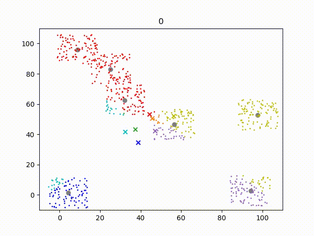

[](https://mybinder.org/v2/gh/RK22000/K-means_Clustering_Visuallization/Binder_demo?labpath=vis.ipynb)

# K-means

An algorithm to discover clusters within data.

I think I fell asleep in class when k-means was covered cuz I recently realized that I didn't actually trust my understanding of the K-means algorithm. So I read the [wiki page](https://en.wikipedia.org/wiki/K-means_clustering) to recap what it is, confirmed that I did actually fall asleep which is why I don't remember this clearly, and coded up a visualization of K-means cuz I realized that its a cool algorithm.

Here's a an example run from the visualization.



## Environment file

Created by command

```sh
conda env export --from-history -f environment.yml
```

Replicated by command

```sh
conda env create -p <Path to new environment location> -f environment.yml
```

or

```sh
conda env create -n <Name of new environment> -f environment.yml
```
